# 🏦 BillingHub - Central Financial API

**BillingHub** is the central infrastructure for payments and subscriptions within the company's product ecosystem (PMS, Booking Engine, etc.).

## 🎯 Objective
To centralize financial complexity by abstracting communication with payment gateways (Pagar.me, Asaas, etc.) and providing a unified interface for billing, subscription management, and financial reconciliation.

---

## 🛠 Tech Stack

- **Language:** Ruby 3.1.2
- **Framework:** Ruby on Rails 7.1 (API Mode)
- **Database:**
  - **Production:** PostgreSQL
  - **Dev/Test:** SQLite3 (to facilitate local simulations)
- **Background Jobs:** Sidekiq + Redis
- **Testing:** RSpec, FactoryBot, Faker
- **Pattern:** Service Objects, Adapters, Multi-tenancy (Apartment)

---

## 🚀 How to Run the Project

### 1. Prerequisites
Ensure you have installed:
- Ruby 3.1.2
- Bundler (`gem install bundler`)
- Redis (for Sidekiq)

### 2. Installation
Clone the repository and install dependencies:
```bash
git clone <repository>
cd billing-hub
bundle install
```

### 3. Database Configuration
The development and test environments are configured to use **SQLite3** to simplify setup.
```bash
# Database creation and migration execution
rails db:create db:migrate
rails db:migrate RAILS_ENV=test
```

### 4. Running Tests (RSpec)
The project uses **RSpec** for automated testing. To run the test suite (including real-life billing scenario simulations):
```bash
bundle exec rspec
```
*Tip: Check `spec/services/billing/process_invoice_service_spec.rb` to see Approval, Refusal, and Timeout scenarios.*

---

## 📚 Project Documentation

To understand the architecture, flows, and data models, consult the `docs/` folder. **It is essential to read the files in the following order:**

1.  **[docs/PROJECT_RESUME.md](docs/PROJECT_RESUME.md)**
    - Overview, glossary, and architectural principles.
2.  **[docs/DOMAINS_AND_ERD.md](docs/DOMAINS_AND_ERD.md)**
    - Definition of models (Tenant, Customer, Invoice, Transaction) and their relationships.
3.  **[docs/FLOWS.md](docs/FLOWS.md)** (⚡ **Important**)
    - Visual diagrams of billing flows and migration strategy (Asaas -> Pagar.me).

> [!IMPORTANT]
> **Diagram Visualization (Mermaid)**
> Documentation files (especially `FLOWS.md`) use **Mermaid** to generate flow diagrams.
> To view them correctly, your IDE must support Mermaid.
> - **VS Code / Windsurf:** Install the **"Markdown Preview Mermaid Support"** extension.
> - **GitHub/GitLab:** Render natively.

### 🧭 Directory Navigation (Micro-Docs)
We have added detailed READMEs in specific directories to explain their internal structure:

| Directory | Content |
| :--- | :--- |
| **[app/README.md](app/README.md)** | **Architecture Diagram**, Controllers, Services, and Models tree. |
| **[config/README.md](config/README.md)** | Configuration details, Key Initializers (Gateways, Multi-tenancy). |
| **[db/README.md](db/README.md)** | Schema design, Migrations, and Seeds information. |
| **[spec/README.md](spec/README.md)** | Testing guide, Factories explanation, and RSpec setup. |

---

## 🏛 Architecture and Patterns

```mermaid
flowchart LR
    %% Styles matching the reference "look" (High Contrast / Black Text)
    classDef actor fill:#e1f5fe,stroke:#01579b,stroke-width:2px,rx:10,ry:10,color:#000;
    classDef layer fill:#f9f9f9,stroke:#9e9e9e,stroke-width:2px,rx:10,ry:10,color:#000;
    classDef component fill:#ffffff,stroke:#333,stroke-width:1px,rx:5,ry:5,color:#000;
    %% Changed DB/Ext to lighter backgrounds so black text is readable
    classDef db fill:#b2dfdb,stroke:#004d40,stroke-width:2px,color:#000,shape:cylinder;
    classDef ext fill:#bbdefb,stroke:#0d47a1,stroke-width:2px,color:#000,rx:20,ry:20;

    %% Left Column: Users/Actors
    subgraph Clients ["👥 External Actors"]
        direction TB
        PMS["🏨 External Products<br/>(PMS / Booking Engine)"]:::actor
        Webhook["🪝 Gateway Webhooks<br/>(Async Notifications)"]:::actor
    end

    %% Center Column: The System Structure
    subgraph System ["🏦 BillingHub Application"]
        direction TB
        
        %% Top Layer: Web/Interface
        subgraph Layer1 ["1. Interface Layer (Web Element)"]
            direction TB
            API_G["🌐 API Routes / Gateway"]:::component
            Auth["🛡️ Authentication Strategy"]:::component
            Controllers["🎮 Thin Controls<br/>(Invoices/Webhooks)"]:::component
        end

        %% Mid Layer: Business Logic
        subgraph Layer2 ["2. Service Layer (EJB/Command Element)"]
            direction TB
            InvService["⚡ ProcessInvoiceService<br/>(Orchestrator)"]:::component
            MigService["🔄 MigrationService<br/>(Asaas -> Pagar.me)"]:::component
            Jobs["⏳ Background Jobs<br/>(Sidekiq Workers)"]:::component
        end

        %% Bottom Layer: Data & Access
        subgraph Layer3 ["3. Domain & Data Layer"]
            direction TB
            Models["📦 Active Record Models<br/>(Invoice, Transaction)"]:::component
            Apartment["🏢 Tenant Router<br/>(Apartment Gem)"]:::component
            Adapters["🔌 Gateway Adapters<br/>(Unified Interface)"]:::component
        end
    end

    %% Right Column: Infra & External
    subgraph Infra ["🏗️ Infrastructure & Services"]
        direction TB
        PG[(PostgreSQL<br/>Multi-Schema)]:::db
        Redis[(Redis<br/>Job Queue)]:::db
        PagarMe("💳 Pagar.me API<br/>(External Service)"):::ext
    end

    %% Connections
    PMS <--> |HTTPS JSON| API_G
    Webhook --> |POST| API_G

    API_G --> Auth
    Auth --> Controllers
    
    Controllers --> |Call| InvService
    Controllers --> |Call| MigService
    Controllers --> |Enqueue| Jobs

    Jobs -.-> |Retry/Async| InvService

    InvService <--> Models
    InvService --> Adapters
    MigService <--> Models

    Models <--> Apartment
    Apartment <--> |Schema Switch| PG
    
    Jobs <--> |Persist/Fetch| Redis
    Adapters <--> |HTTP Request| PagarMe

    %% Force Vertical Stacking/Spacing (Ghost Edges)
    %% This prevents nodes from floating around or overlapping
    API_G ~~~ Auth ~~~ Controllers
    InvService ~~~ MigService ~~~ Jobs
    Models ~~~ Apartment ~~~ Adapters
    PG ~~~ PagarMe ~~~ Redis

    %% Layer Visuals (Force Black Text on Light Backgrounds)
    style Layer1 fill:#eceff1,stroke:#cfd8dc,color:#000
    style Layer2 fill:#fff3e0,stroke:#ffe0b2,color:#000
    style Layer3 fill:#e8f5e9,stroke:#c8e6c9,color:#000

    %% Outer Containers
```



### Adapter Pattern
Translation layer between BillingHub and Gateways (Pagar.me, Asaas). Located in `app/gateways`. Allows switching providers without altering core business logic.

### Services (SimpleCommand)
All business logic resides in services (`app/services`). Controllers are thin and only delegate to services.
- Example: `Billing::ProcessInvoiceService.call(invoice)`

### Multi-tenancy
The system is prepared for multi-tenancy (data separation by client/hotel) using the `ros-apartment` gem.
*Note: Temporarily disabled in Dev/Test to simplify RSpec.*
