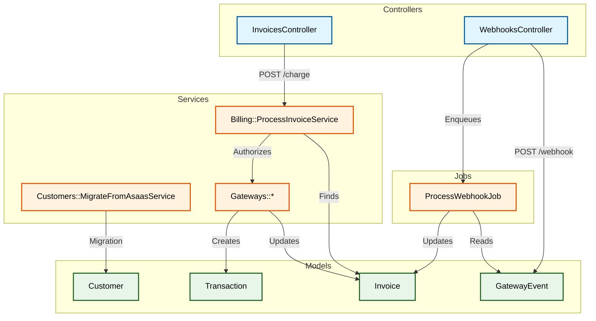

# 📦 App Directory

This directory contains the core application code, following the **MVC** (Model-View-Controller) pattern, adapted for an API-first approach with Service Objects.

## 📂 Structure

| Directory | Description |
| :--- | :--- |
| **controllers/** | **Input/Output Layer.** Thin controllers that handle HTTP requests, authenticate users, and delegate business logic to Services. |
| **models/** | **Data Layer.** Active Record models representing database tables. Contains validations and associations. |
| **services/** | **Business Logic Layer.** Contains `Command` objects that encapsulate complex logic (e.g., Billing, Migration). |
| **jobs/** | **Async Layer.** Background jobs (Sidekiq) for processing webhooks and heavy tasks. |
| **gateways/** | **Adapter Layer.** (Located inside `services` or `gateways` usually, here likely `services/gateways` or top level). |
| **mailers/** | **Notification Layer.** Handles email sending. |

---

## 🌳 Component Relationship & Flow

The following diagram illustrates how Controllers delegate work to Services, which then interact with Models and Gateways.

