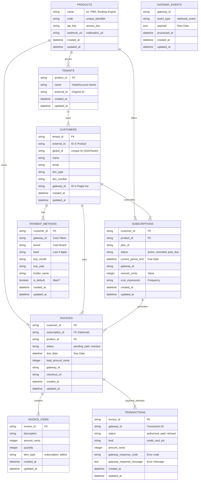

# Entities and Database

This document explains how we organize data in BillingHub. The idea is to mirror the real world of payments.

## Visual Diagram (ERD)

### 1. Context (Who uses it?)
*   **Products:** Systems (PMS, Booking Engine, etc). Each has an `api_key` to send charges to BillingHub.
*   **Tenants:** Customers of the products (e.g., "Farm Hotel X").

### 2. Customers
*   The actual customer.
*   **Key Point:** We store `gateway_id` to know who this customer is in Pagar.me.

### 3. Payment Methods
*   **Security:** We do NOT store card information. We store only a **Token** provided by Pagar.me.
*   Maintains data security on both ends; token leaks do not compromise customer data.

### 4. Subscriptions
*   Recurring revenue guarantee. Controls how much to charge and when (cycle).
*   If the customer doesn't pay, status changes to `past_due` automatically.

### 5. Invoices and Items
*   The billing document.
*   It can have multiple **Items**: E.g., "September Fee" + "SMS Cost" + "Extra Fee". We sum everything and make a single charge.

### 6. Transactions
*   The real history.
*   If we try to charge the card and it returns "Insufficient Funds", we create a Failure transaction.
*   If we try again and it succeeds, we create a Success transaction.
*   We never delete this history.

### 7. Gateway Events (GatewayEvents)
*   The "Black Box". Everything Pagar.me sends us (via Webhook), we save here before processing.
*   If our code errors, the data is saved here for retry. Acts as a data entry log.
*   Initially, it doesn't matter what is saved in this model; date will be processed asynchronously.
