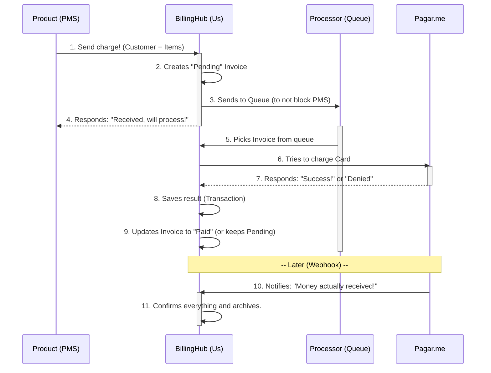
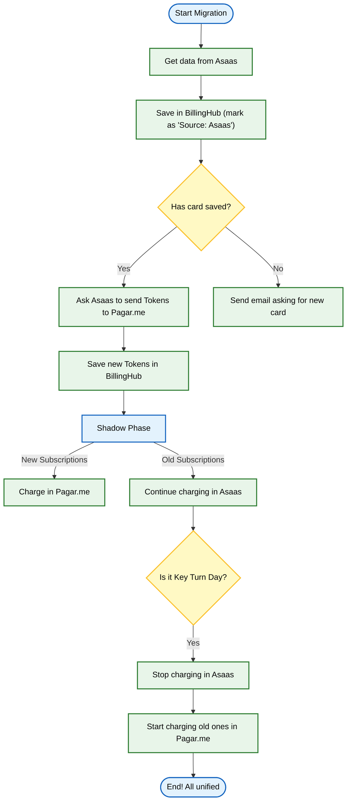

# Main Flows

Here we explain how things happen "behind the scenes".

## 1. Billing Flow

How does it work when we need to charge a customer?

---

## 2. Migration Plan (Asaas -> Pagar.me)

How we change gateways without stopping billing and without bothering the customer to ask for the card again.

### The Strategy

1.  **Transparent Migration:** We will use data portability (PCI) to migrate cards directly between Asaas and Pagar.me. The customer won't even notice the processor change.
2.  **Shadow Phase (Shadow Billing):**
    *   New customer? Goes directly to Pagar.me.
    *   Old customer? Stays on Asaas for a while, to ensure the new system is stable.
3.  **Key Turn Day:** When we are confident, we "turn off" charges in Asaas and activate in Pagar.me for old customers.
